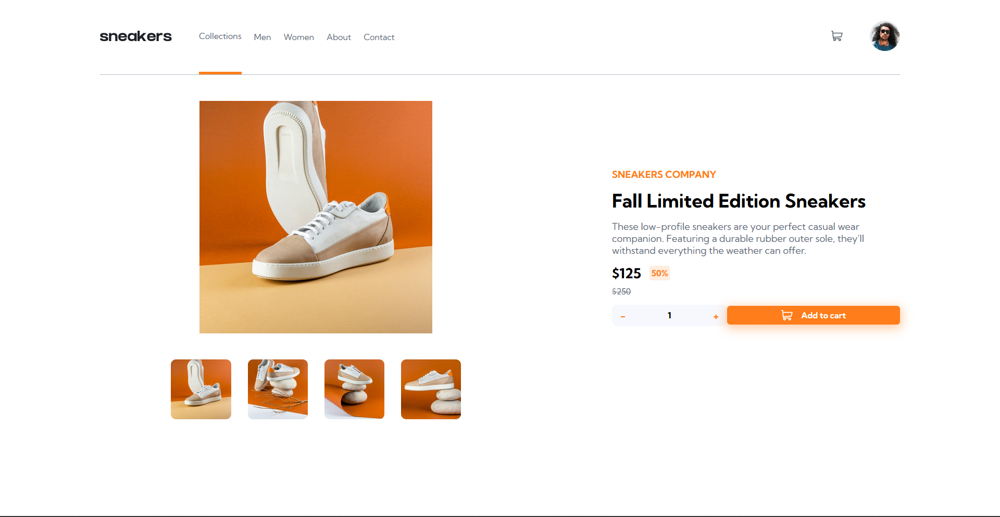

# Frontend Mentor - Todo app

This is a solution to the [E-commerce product page challenge on Frontend Mentor](https://www.frontendmentor.io/challenges/ecommerce-product-page-UPsZ9MJp6)

### Screenshot

### Links

- Live Site URL: [https://moselsh.github.io/Ecommerce-Product-Page/](https://moselsh.github.io/Ecommerce-Product-Page/)

### Built with

- Semantic HTML5 markup
- CSS custom properties
- Flexbox
- JavaScript
- React